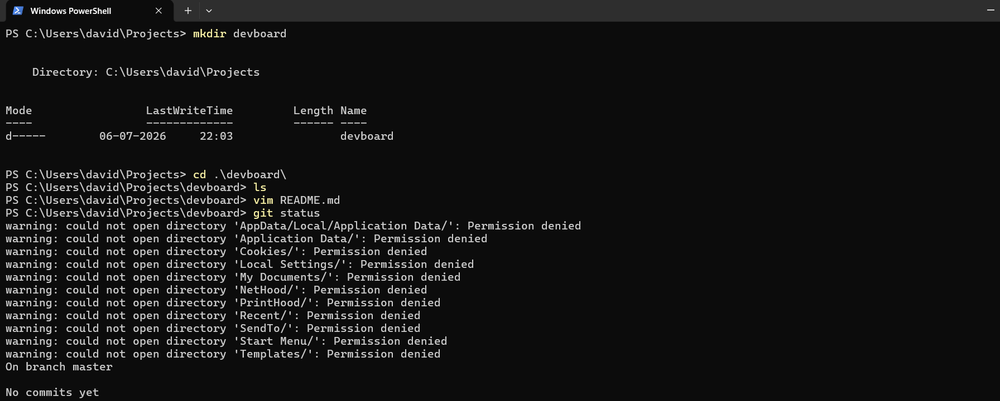
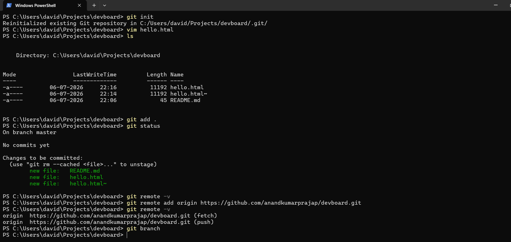
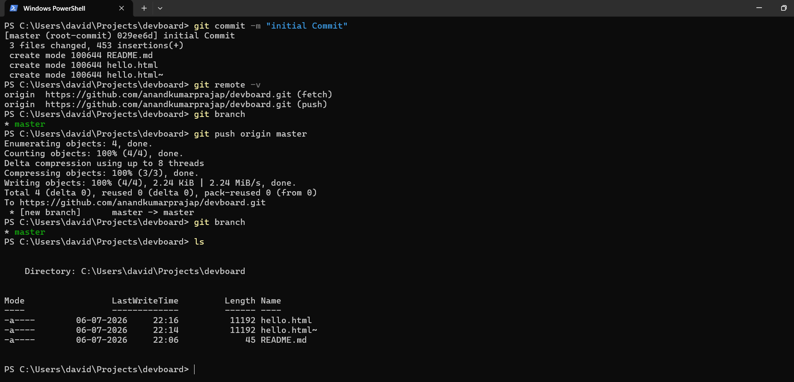
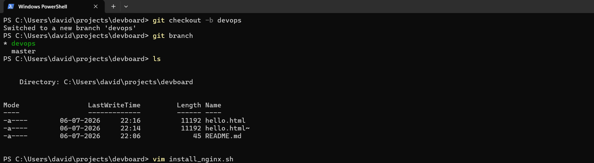
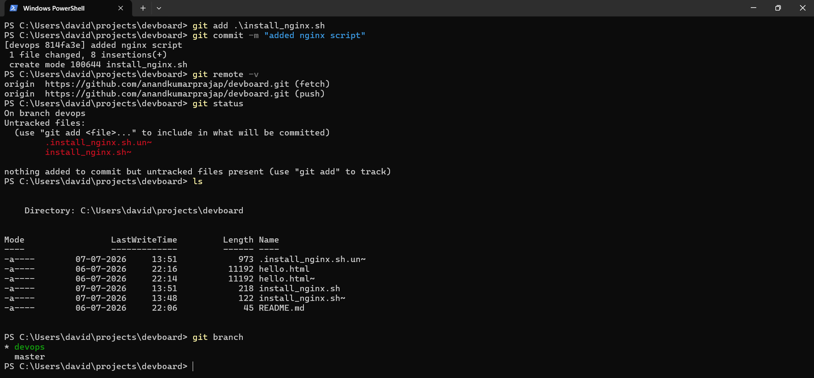
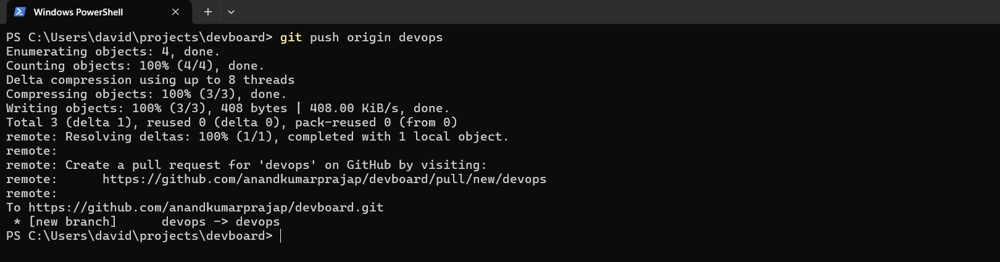
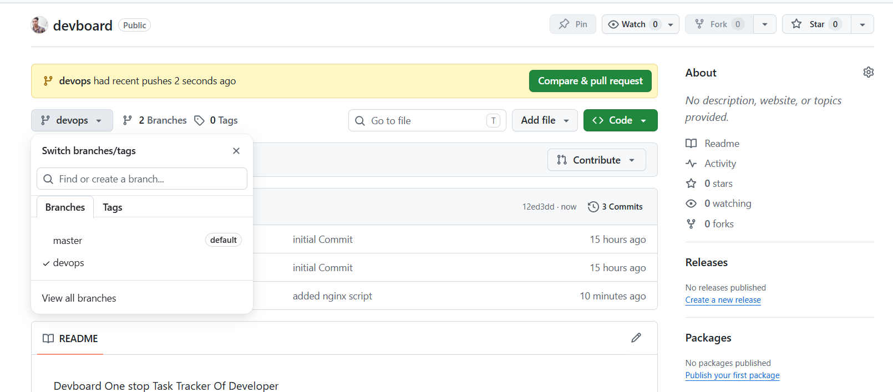

# Git Branching Notes








## Objective

Learn how to:

- Understand Git branches
- Create a local Git repository
- Make the first (root) commit
- Create a new branch
- Switch between branches
- Push different branches to GitHub
- Understand the difference between `master` and `main`

---

# What is a Branch?

A branch is an independent line of development in Git.

It allows developers to work on new features, bug fixes, or experiments without affecting the main project.

---

# Root Branch

When a Git repository is initialized, Git creates the first branch.

Historically, this branch was called:

```
master
```

This is also known as the **root branch** because all other branches originate from it.

---

# Why Do Some Repositories Use `main`?

Originally, Git used **master** as the default branch.

In 2020, GitHub changed its default branch name to **main** for new repositories.

Today:

- Older repositories often use **master**
- New GitHub repositories usually use **main**

Git itself supports both names.

---

# Master vs Main

| master | main |
|---------|------|
| Original default branch | New GitHub default branch |
| Used by older repositories | Used by new repositories |
| Same functionality | Same functionality |
| Only the name is different | Only the name is different |

> There is **no technical difference** between `master` and `main`.

---

# Branch Structure

```
master (or main)
│
├── devops
├── frontend
├── backend
├── feature-login
└── bug-fix
```

Every branch starts from the root branch.

---

# Practical

## Create a Project

```bash
mkdir devboard
cd devboard
```

---

## Initialize Git

```bash
git init
```

---

## Create Files

```bash
vim README.md
vim hello.html
```

---

## Check Repository Status

```bash
git status
```

---

## Stage Files

```bash
git add .
```

---

## Create the First Commit

```bash
git commit -m "Initial commit"
```

This is called the **Root Commit**.

Example output:

```
[master (root-commit) 029ee6d] Initial commit
```

---

## Add Remote Repository

```bash
git remote add origin https://github.com/username/devboard.git
```

Verify:

```bash
git remote -v
```

---

## Push the Master Branch

```bash
git push origin master
```

---

## View Branches

```bash
git branch
```

Output:

```
* master
```

---

# Create a New Branch

```bash
git checkout -b devops
```

Or (recommended in newer Git versions):

```bash
git switch -c devops
```

---

## Verify Branch

```bash
git branch
```

Output:

```
* devops
  master
```

---

# Add a New File

```bash
vim install_nginx.sh
```

---

## Commit Changes

```bash
git add install_nginx.sh

git commit -m "Added nginx installation script"
```

---

# Push the DevOps Branch

```bash
git push origin devops
```

GitHub will display:

```
Create a pull request for 'devops'
```

This means the branch has been successfully uploaded.

---

# Branch Workflow

```
master
   │
   ├───────────────┐
                   │
                devops
                   │
         install_nginx.sh
                   │
               Commit
                   │
               Push to GitHub
```

---

# Useful Commands

```bash
git init
```

```bash
git status
```

```bash
git add .
```

```bash
git commit -m "message"
```

```bash
git branch
```

```bash
git checkout -b devops
```

```bash
git switch -c devops
```

```bash
git remote -v
```

```bash
git push origin master
```

```bash
git push origin devops
```

---

# Observation

- Initialized a Git repository.
- Created the root commit.
- Connected the local repository to GitHub.
- Pushed the `master` branch.
- Created a new `devops` branch.
- Added a new script in the `devops` branch.
- Committed and pushed the new branch to GitHub.
- Learned that branches allow independent development without affecting the main codebase.

---

# Conclusion

Git Branching enables multiple developers or teams to work on different features simultaneously. The root branch (`master` or `main`) remains stable while new work is developed in separate branches and later merged back into the main project.
