# Git & GitHub Hands-on Notes

## Objective
Learn how to:
- Create shell scripts
- Initialize a Git repository
- Track files using Git
- Generate SSH keys
- Connect GitHub with SSH
- Push code from Local → GitHub
- Pull changes from GitHub → Local

---

# 1. Create a Shell Script

```bash
mkdir shell-scripts
cd shell-scripts

vim hello.txt
rm hello.txt

vim hello.sh
```

### hello.sh

```bash
#!/bin/bash

read -p "Enter a name: " name
echo "hello.dosto, $name"
```

Check the file:

```bash
cat hello.sh
```

Give execute permission:

```bash
chmod 746 hello.sh
```

Check permissions:

```bash
ls -l
```

Run the script:

```bash
./hello.sh
```

Example Output

```
Enter a name:
Anand

hello.dosto, Anand
```

---

## Screenshot

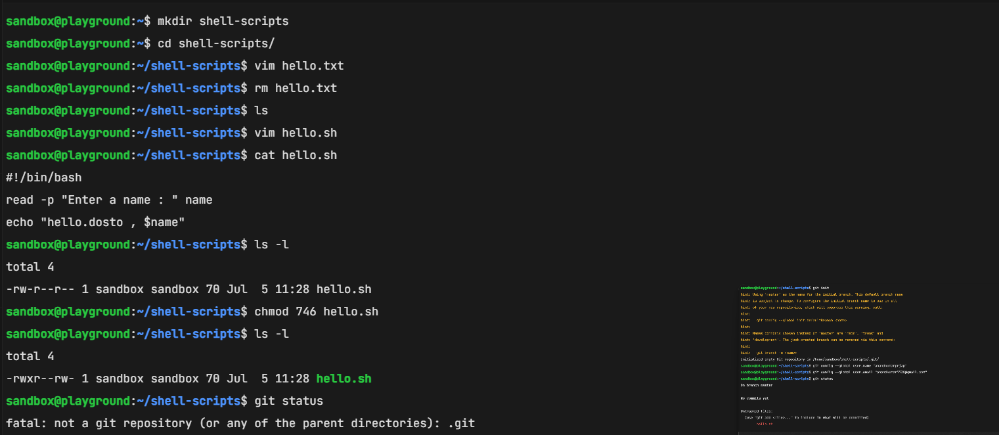
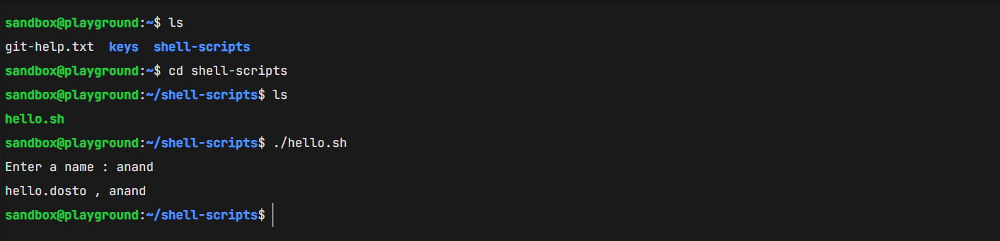

- Creating shell-scripts directory
- Creating hello.sh
- Running the shell script
- File permissions
- Script execution

---

# 2. Version Control System (VCS)

## What is Git?

Git is a **Distributed Version Control System (DVCS)**.

It helps developers:

- Track file changes
- Restore previous versions
- Collaborate with teams
- Share projects

### Distributed Version Control

Examples

- GitHub
- GitLab
- Bitbucket

Each developer has a complete copy of the repository.

### Centralized Version Control

Example

- SVN (Subversion)

Only one central server stores the project.

---

# 3. Initialize Git Repository

Check repository status:

```bash
git status
```

Output:

```
fatal: not a git repository
```

Initialize Git:

```bash
git init
```

Configure Git:

```bash
git config --global user.name "anandkumarprjap"
git config --global user.email "anandkumar7738@gmail.com"
```

Check status:

```bash
git status
```

---

## Screenshot

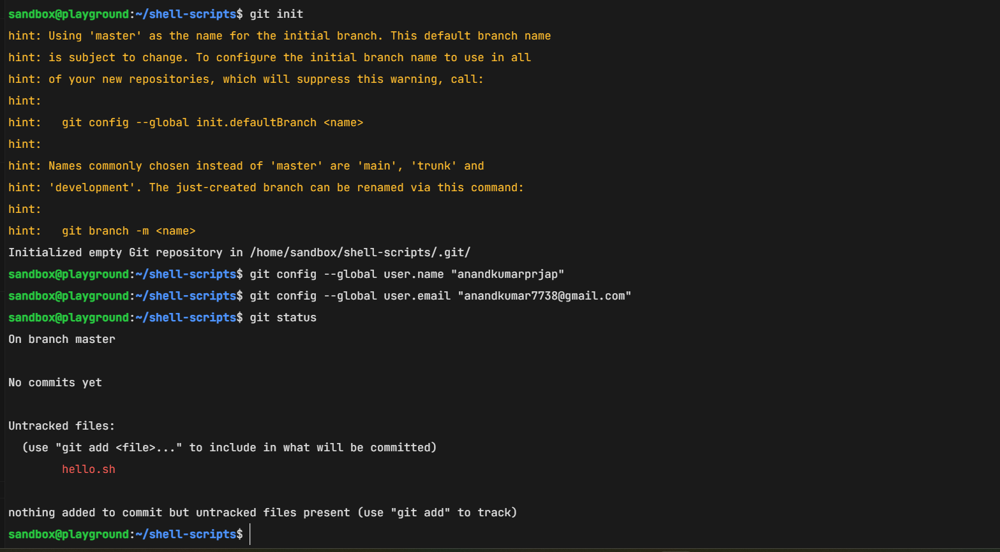

- git init
- Git configuration

---

# 4. Add and Commit Files

Add file:

```bash
git add hello.sh
```

Check status:

```bash
git status
```

Commit:

```bash
git commit -m "added shell script"
```

Check status again:

```bash
git status
```

---

## Screenshot

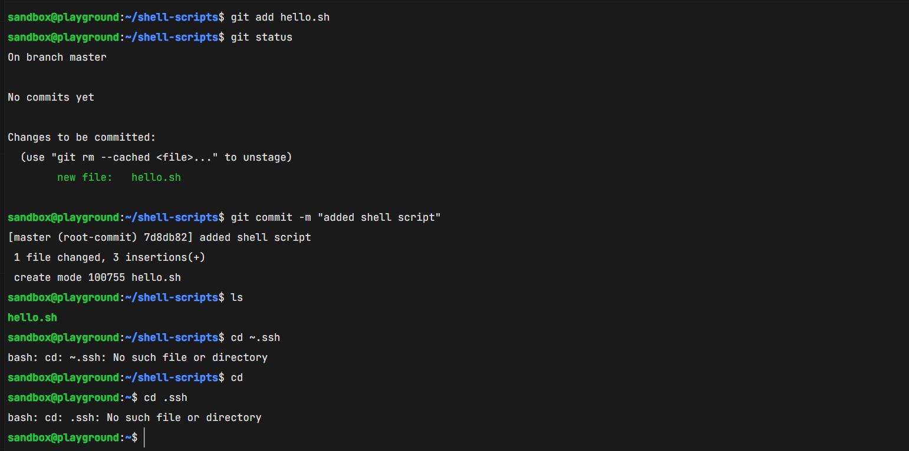

- git add
- git status

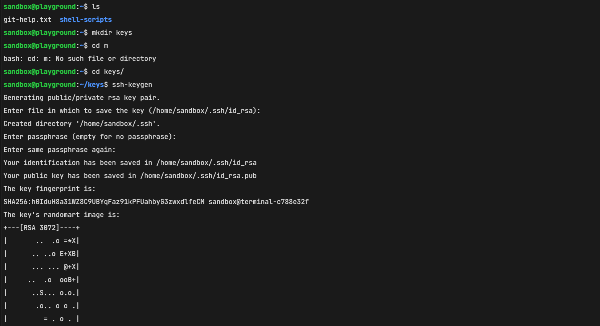

- git commit

---

# 5. SSH Authentication

Generate SSH Key

```bash
ssh-keygen
```

Press **Enter** for all default options.

Check SSH directory:

```bash
cd ~/.ssh

ls
```

View Public Key

```bash
cat id_rsa.pub
```

Copy the complete key.

---

## Screenshot

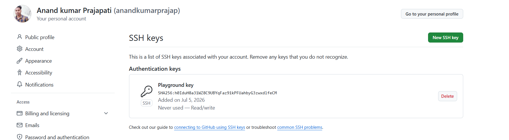

- ssh-keygen

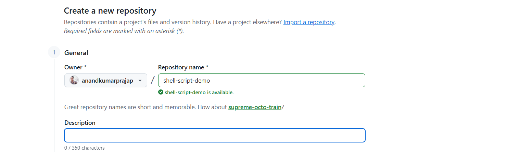

- id_rsa.pub

---

# 6. Add SSH Key to GitHub

1. Login to GitHub
2. Click Profile
3. Settings
4. SSH and GPG Keys
5. New SSH Key
6. Title

```
Playground Key
```

7. Key Type

```
Authentication Key
```

8. Paste the public key

9. Click **Add SSH Key**

10. Verify authentication.

---

## Screenshot


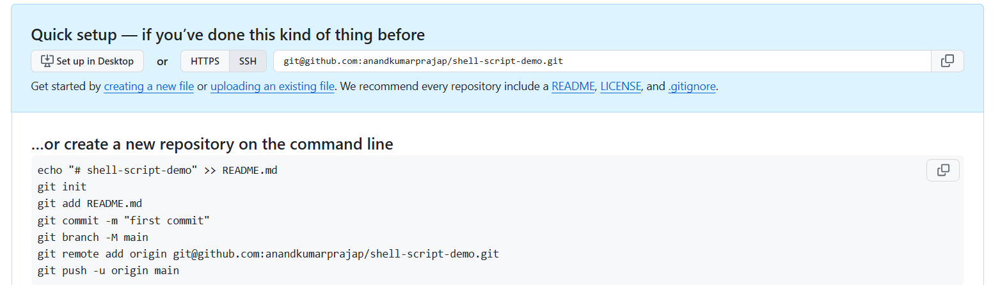

- SSH key added successfully

---

# 7. Create GitHub Repository

Create Repository

```
shell-script-demo
```

Copy the SSH URL.

Example

```
git@github.com:anandkumarprajap/shell-script-demo.git
```

---

# 8. Connect Local Repository to GitHub

Add remote:

```bash
git remote add origin git@github.com:anandkumarprajap/shell-script-demo.git
```

Verify:

```bash
git remote -v
```

Check branch:

```bash
git branch
```

Output

```
master
```

---

## Screenshot

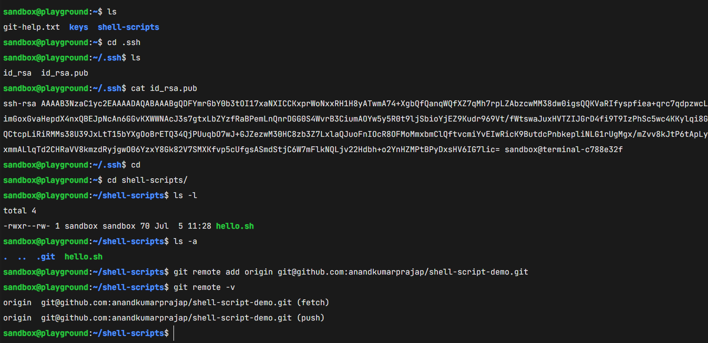

- git remote -v
- git branch

---

# 9. Push Local Repository to GitHub

Push code:

```bash
git push origin master
```

First time:

```
Are you sure you want to continue connecting?

yes
```

Git uploads all commits to GitHub.

---

## Screenshot

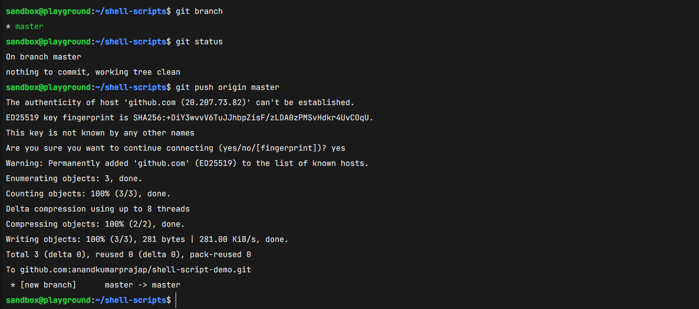

- git push
- Push successful

---

# 10. Local → GitHub Workflow

```
Create File
      │
      ▼
git add
      │
      ▼
git commit
      │
      ▼
git push
      │
      ▼
GitHub Repository
```

---

# 11. SSH Workflow Diagram

```
+-------------------------+
|      Local Machine      |
|-------------------------|
| hello.sh                |
| Git Repository          |
| Private Key (id_rsa)    |
+-----------+-------------+
            |
            | SSH Authentication
            |
            ▼
+-------------------------+
|        GitHub           |
|-------------------------|
| Public Key              |
| Remote Repository       |
+-------------------------+
```

Private Key → Local Machine

Public Key → GitHub

SSH provides **password-less authentication**.

---

# 12. Pull Changes from GitHub

Run:

```bash
git pull origin master
```

New file downloaded:

```
variable.sh
```

Check files:

```bash
ls
```

Output

```
hello.sh
variable.sh
```

View contents:

```bash
cat variable.sh
```

Output

```
Name "Anand"

Location "Pune"
```

---

## Screenshot

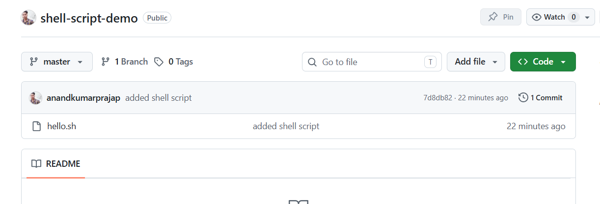

- Repository before pull

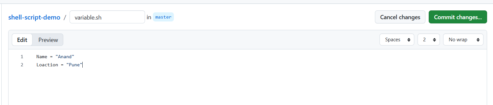

- git pull

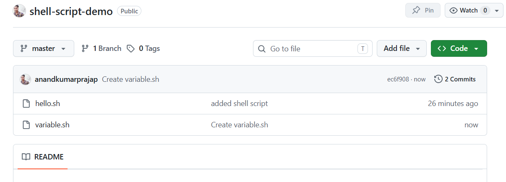

- variable.sh downloaded

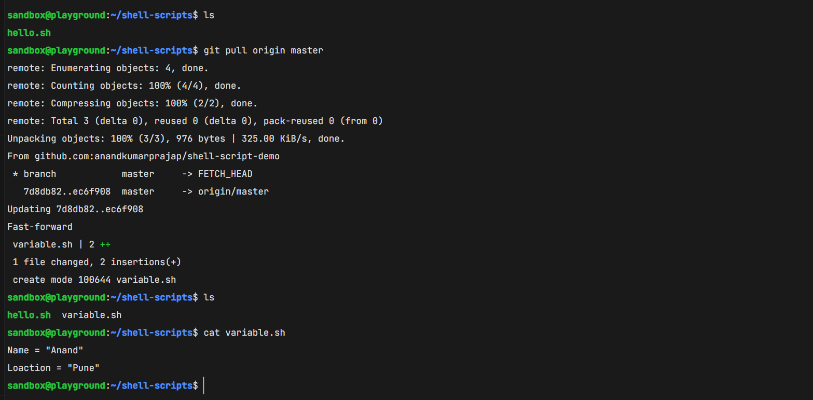

- cat variable.sh

---

# 13. Git Workflow

```
Working Directory
        │
        ▼
git add
        │
        ▼
Staging Area
        │
        ▼
git commit
        │
        ▼
Local Repository
        │
        ▼
git push
        │
        ▼
GitHub Repository
        │
        ▼
git pull
        │
        ▼
Local Repository Updated
```

---

# Commands Used

```bash
mkdir shell-scripts
cd shell-scripts
vim hello.sh
chmod 746 hello.sh
./hello.sh
git init
git config --global user.name
git config --global user.email
git status
git add hello.sh
git commit -m "added shell script"
ssh-keygen
cat ~/.ssh/id_rsa.pub
git remote add origin <SSH_URL>
git remote -v
git branch
git push origin master
git pull origin master
```

---

# Conclusion

In this practical session, we learned:

- Linux file creation
- Shell scripting
- File permissions
- Git initialization
- Git staging
- Git commits
- SSH key generation
- GitHub SSH authentication
- Remote repository setup
- Push local repository to GitHub
- Pull changes from GitHub to local repository

This completes the basic Git and GitHub workflow from **Local → GitHub → Local**.
