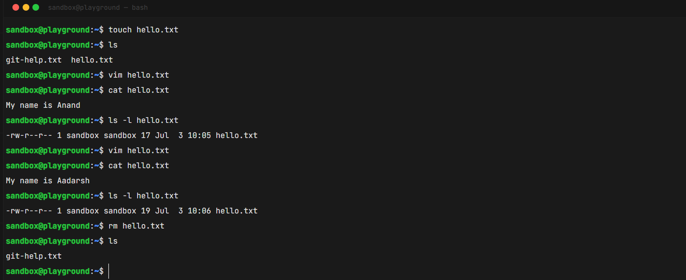
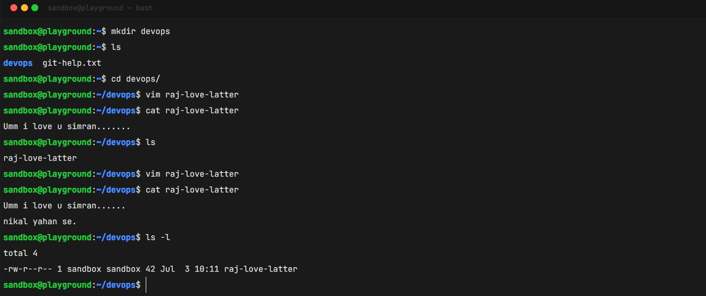
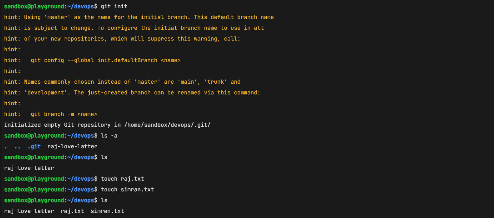
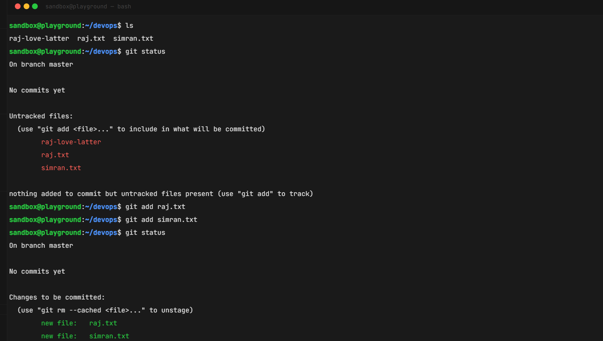
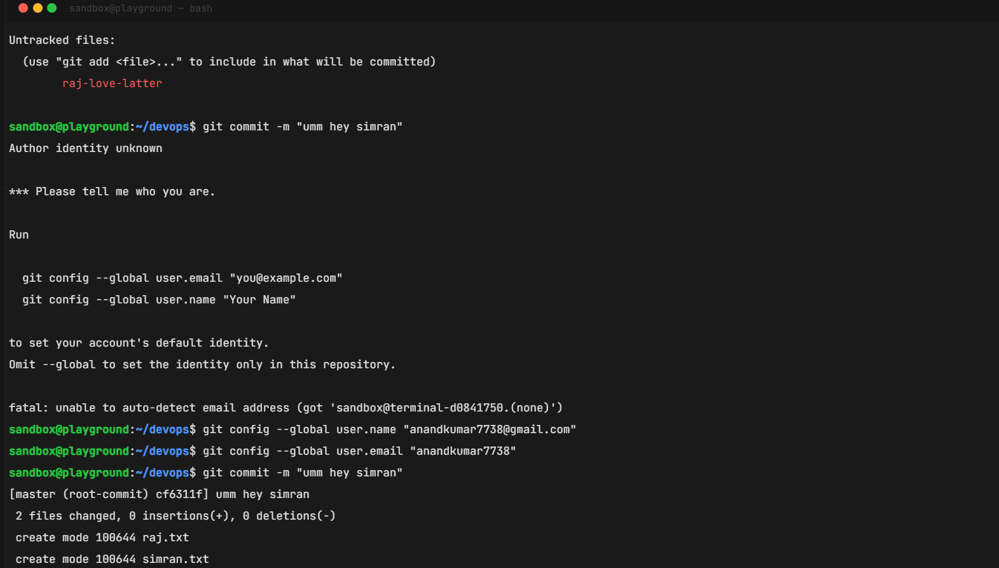
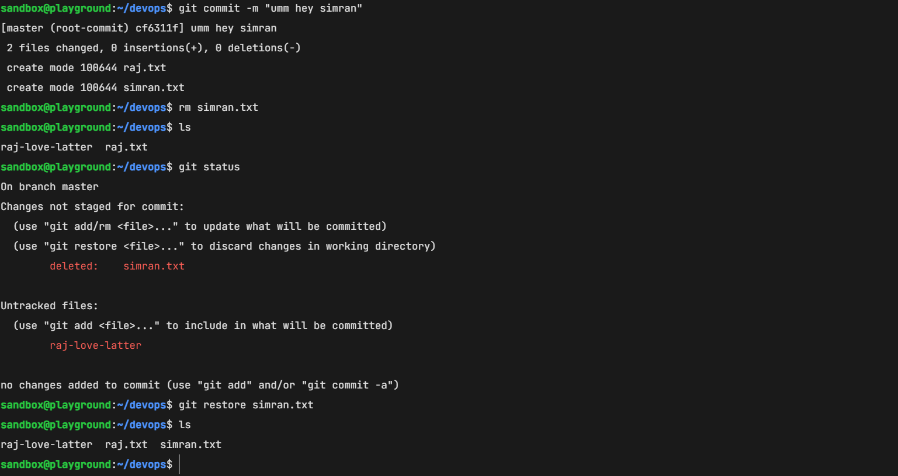
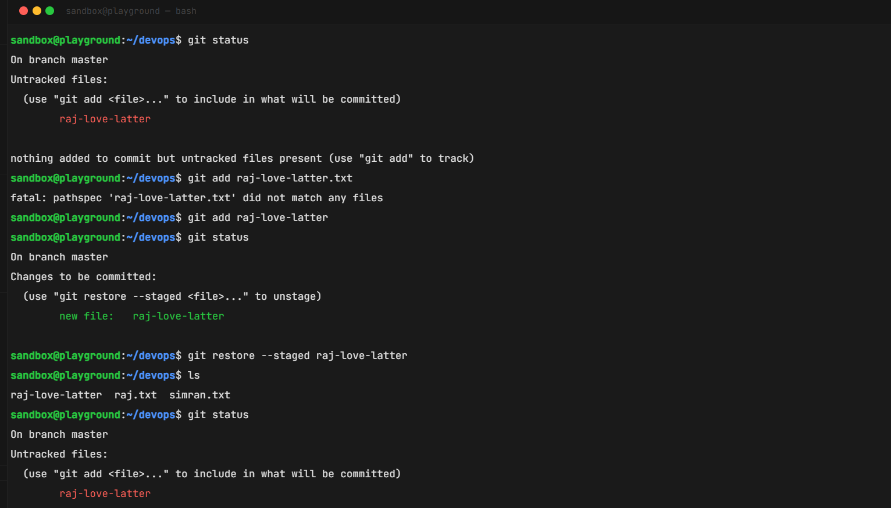
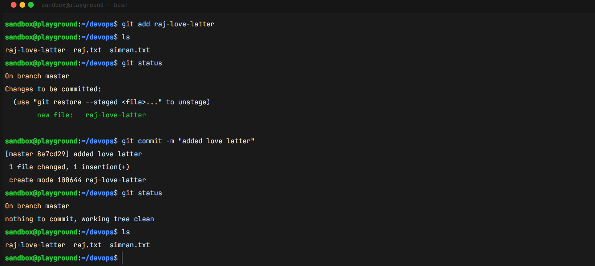

# Git-GitHub-&-GitLab
GitLab is an all-in-one platform featuring built-in DevOps and continuous integration (CI/CD), highly favored by enterprises for security and private hosting
# Git Practice Screenshots

---

## 1.png – Linux File System Practice (Without Git)



**Objective:**
Understand the limitation of the Linux file system.

### Commands Performed

```bash
touch hello.txt
vim hello.txt
cat hello.txt
ls -l hello.txt
rm hello.txt
ls
```

### Observation

- Created a file.
- Modified the file.
- Deleted the file.
- Linux file system cannot track history.
- Deleted file cannot be restored easily.

---

## 2.png – File Modification Before Git Initialization



**Objective:**
Understand that changes are not tracked before using Git.

### Commands Performed

```bash
mkdir devops
cd devops
vim raj-love-latter
cat raj-love-latter
ls -l
```

### Observation

- Created a new file.
- Modified its content.
- Linux only stores the latest version.
- No version history exists.

---

## 3.png – Initialize Git Repository



**Objective:**
Create an empty Git repository.

### Commands Performed

```bash
git init
ls -a
```

### Observation

- Git created a hidden `.git` directory.
- Current folder is now a Git repository.
- Git can now track file changes.

---

## 4.png – Check Git Status and Add Files



**Objective:**
Move files from the Working Directory to the Staging Area.

### Commands Performed

```bash
touch raj.txt
touch simran.txt
git status
git add raj.txt
git add simran.txt
git status
```

### Observation

- Files were initially **Untracked**.
- After `git add`, files moved to the **Staging Area**.
- Git status changed to **Changes to be committed**.

---

## 5.png – Configure Git and Create First Commit



**Objective:**
Save the first version of the project.

### Commands Performed

```bash
git config --global user.name "Anand Kumar"
git config --global user.email "anandkumar7738@gmail.com"

git commit -m "umm hey simran"
```

### Observation

- Configured Git username and email.
- Created the first commit.
- Git permanently stored the files.
- Output displayed `create mode 100644`.

---

## 6.png – Restore Deleted File



**Objective:**
Recover a deleted tracked file.

### Commands Performed

```bash
rm simran.txt
git status
git restore simran.txt
ls
```

### Observation

- Deleted a tracked file.
- Git detected the deletion.
- `git restore` recovered the file successfully.

---

## 7.png – Stage and Unstage a File



**Objective:**
Learn how to add and remove files from the Staging Area.

### Commands Performed

```bash
git add raj-love-latter
git status

git restore --staged raj-love-latter
git status
```

### Observation

- File moved to the Staging Area.
- `git restore --staged` removed it from staging.
- File remained in the Working Directory.

---

## 8.png – Commit the New File



**Objective:**
Save the staged file into Git history.

### Commands Performed

```bash
git add raj-love-latter
git commit -m "Added love letter"

git status
```

### Observation

- New file committed successfully.
- Working tree became clean.
- Git repository now contains multiple commits.

---

# Git Workflow Diagram

```text
Working Directory
       │
       │  git add
       ▼
+------------------+
|   Staging Area   |
+------------------+
       │
       │  git commit
       ▼
+------------------+
|  Local Git Repo  |
+------------------+
       │
       │  git push
       ▼
      GitHub
```

---

# File State Diagram

```text
Create File
     │
     ▼
Untracked
     │
     │ git add
     ▼
Staged
     │
     │ git commit
     ▼
Tracked (Git Repository)
```
.......................................................................................................................................................

# Table of Contents

1. What is Git?
2. Why was Git created?
3. Linux File System vs Git
4. Why DevOps Engineers use Git
5. Git Architecture
6. Git Workflow
7. Important Git Commands
8. Git Example
9. Git File States
10. Git Restore
11. Git Configuration
12. Git Branching
13. Git History
14. Git Remote Commands
15. Interview Questions
16. Summary

---

# 1. What is Git?

## Definition

Git is a **Distributed Version Control System (DVCS)**.

It was created by **Linus Torvalds** in **2005** to manage the development of the Linux Kernel.

Git helps developers:

- Track file changes
- Store history
- Recover deleted files
- Work with multiple developers
- Create different versions of a project
- Merge code safely

> **Correction**
>
> Linux was created in **1991**.
>
> Git was created later in **2005**.

---

# What is Version Control?

Version Control means storing every version of your project.

Example

Version 1
```
Hello
```

Version 2

```
Hello Anand
```

Version 3

```
Hello Anand Kumar
```

Git stores every version.

You can go back to any previous version anytime.

---

# 2. Why was Git Created?

Before Git,

Developers used only the Linux file system.

Problems:

- No history
- Cannot track who changed a file
- Cannot recover deleted files easily
- Difficult for multiple developers to work together

Therefore,

Linus Torvalds created Git.

---

# 3. Linux File System vs Git

| Linux File System | Git |
|-------------------|-----|
| Stores files | Stores files + history |
| No version control | Version control |
| Cannot easily recover deleted files | Can recover committed files |
| No author tracking | Tracks author |
| No commit history | Full commit history |
| Cannot compare versions | Can compare versions |
| Difficult collaboration | Easy collaboration |

Example

Linux

```
hello.txt

Edit

Edit

Delete

Gone forever
```

Git

```
hello.txt

Commit 1

Commit 2

Commit 3

Delete

Restore anytime
```

---

# 4. Why DevOps Engineers Care About Git?

DevOps connects Developers and Operations.

Developer

↓

Writes Code

↓

Git

↓

CI/CD Pipeline

↓

Testing

↓

Deployment

↓

Production

Git is the source of truth for CI/CD.

Without Git,

CI/CD cannot know which code to build.

---

# 5. Git Architecture

```
            Git Repository

        +----------------------+
        | Commit History       |
        | Version 1            |
        | Version 2            |
        | Version 3            |
        +----------------------+

                 ▲
                 |
             git commit

        +----------------------+
        |    Staging Area      |
        +----------------------+

                 ▲
                 |
              git add

        +----------------------+
        | Working Directory    |
        | Files you edit       |
        +----------------------+
```

---

# Git Workflow

```
Create File

↓

Working Directory

↓

git add

↓

Staging Area

↓

git commit

↓

Git Repository
```

---

# File States

```
Untracked

↓

git add

↓

Staged

↓

git commit

↓

Tracked
```

Diagram

```
+-----------------+
| Untracked File  |
+-----------------+
        |
        | git add
        v
+-----------------+
| Staging Area    |
+-----------------+
        |
        | git commit
        v
+-----------------+
| Git Repository  |
| Tracked File    |
+-----------------+
```

---

# 6. Git Example

Create a file

```
touch raj.txt
```

Git status

```
git status
```

Output

```
Untracked files:

raj.txt
```

Means Git knows the file exists but is not tracking it.

---

Stage file

```
git add raj.txt
```

Output

```
Changes to be committed

new file: raj.txt
```

Meaning

The file is now inside the **Staging Area**.

---

Commit

```
git commit -m "Added raj file"
```

Output

```
create mode 100644 raj.txt
```

Meaning

Git permanently saved this version.

Now the file is tracked.

---

# What does "create mode 100644" mean?

Example

```
create mode 100644 raj.txt
```

100644 is the Linux file permission stored by Git.

Meaning

```
Owner

Read
Write

Group

Read

Others

Read
```

Git stores file permissions along with the file.

You do **not** need to remember the number for interviews.

Just know:

```
100644

↓

Normal file created and committed successfully.
```

---

# 7. git init

Command

```
git init
```

Meaning

Initialize an empty Git repository.

Output

```
Initialized empty Git repository
```

Git creates a hidden folder

```
.git
```

This folder stores

- Commit history
- Branches
- Configuration
- Objects
- Logs

Check hidden files

```
ls -a
```

Output

```
.git
```

Without `.git`, Git will not work.

---

# 8. git status

Shows

- Current branch
- Tracked files
- Untracked files
- Modified files
- Staged files

Example

```
git status
```

Output

```
On branch master

Untracked files

raj.txt
```

---

# 9. git add

Purpose

Moves files to the staging area.

Example

```
git add raj.txt
```

Stage all files

```
git add .
```

Meaning

```
Working Directory

↓

Staging Area
```

---

# 10. git commit

Purpose

Creates a permanent snapshot.

Example

```
git commit -m "Added login page"
```

Think of commit as

```
Save Game

OR

Checkpoint
```

---

# 11. git restore

Restore deleted file

Example

```
rm simran.txt
```

Status

```
deleted: simran.txt
```

Recover

```
git restore simran.txt
```

File comes back.

---

Unstage file

```
git restore --staged raj.txt
```

Meaning

Remove from staging area.

File still exists.

---

# 12. Git Configuration

Git needs author information.

Configure once

```
git config --global user.name "Anand Kumar"
```

```
git config --global user.email "anand@example.com"
```

Check configuration

```
git config --list
```

> **Correction from your notes:**
>
> `user.name` should be your **name**, not your email.
>
> Correct:
> ```
> git config --global user.name "Anand Kumar"
> git config --global user.email "anandkumar7738@gmail.com"
> ```

---

# 13. Git Branch

List branches

```
git branch
```

Create branch

```
git branch dev
```

Switch branch

```
git checkout dev
```

Create + Switch

```
git checkout -b feature
```

Merge

```
git merge feature
```

Delete

```
git branch -d feature
```

---

# 14. Git History

Show commits

```
git log
```

Short version

```
git log --oneline
```

Example

```
5d32ab Added Login

31dcaf Fixed Bug

f45dea Initial Commit
```

---

# 15. Git Difference

Unstaged changes

```
git diff
```

Staged changes

```
git diff --staged
```

---

# 16. Git Reset

Undo last commit

```
git reset HEAD~1
```

Moves back one commit.

---

# 17. Git Stash

Save unfinished work

```
git stash
```

Bring work back

```
git stash pop
```

Useful when switching branches.

---

# 18. Remote Repository

See remotes

```
git remote -v
```

Add GitHub repository

```
git remote add origin <repository-url>
```

Upload code

```
git push
```

Download changes

```
git pull
```

Fetch changes

```
git fetch
```

---

# Git Workflow Diagram

```
Create File

↓

Untracked

↓

git add

↓

Staging Area

↓

git commit

↓

Git Repository

↓

git push

↓

GitHub
```

---

# Git vs GitHub

| Git | GitHub |
|------|---------|
| Version Control System | Cloud hosting platform |
| Works locally | Works online |
| Tracks changes | Stores Git repositories |
| Free software | Provides collaboration features |

---

# Most Used Git Commands

## Setup

```
git config --global user.name "Your Name"
git config --global user.email "you@example.com"
```

---

## Basic

```
git init
git status
git add .
git add <file>
git commit -m "message"
git clone <url>
git push
git pull
```

---

## Branch

```
git branch
git branch dev
git checkout dev
git checkout -b feature
git merge feature
git branch -d feature
```

---

## History

```
git log
git log --oneline
git diff
git diff --staged
```

---

## Undo

```
git restore file
git restore --staged file
git reset HEAD~1
git stash
git stash pop
```

---

## Remote

```
git remote -v
git remote add origin <url>
git fetch
git pull
git push
```

---

# Interview Questions

### What is Git?

Git is a Distributed Version Control System used to track source code changes.

---

### Who created Git?

Linus Torvalds.

---

### When was Git created?

2005.

---

### What does git init do?

Initializes an empty Git repository by creating the hidden `.git` directory.

---

### What is git add?

Moves changes from the Working Directory to the Staging Area.

---

### What is git commit?

Creates a permanent snapshot of staged changes in the local Git repository.

---

### What is git status?

Displays the current status of the working directory and staging area.

---

### What is git restore?

Restores a modified or deleted tracked file, or removes files from the staging area with `--staged`.

---

### What is the difference between Git and GitHub?

Git is a version control system that runs locally, while GitHub is a cloud platform for hosting Git repositories and collaborating with others.

---

# Summary

```
git init
    ↓
Initialize repository

git status
    ↓
Check file status

git add
    ↓
Move files to staging

git commit
    ↓
Save snapshot in Git history

git push
    ↓
Upload commits to GitHub

git pull
    ↓
Download latest changes

git restore
    ↓
Recover or discard changes

git log
    ↓
View commit history
```
