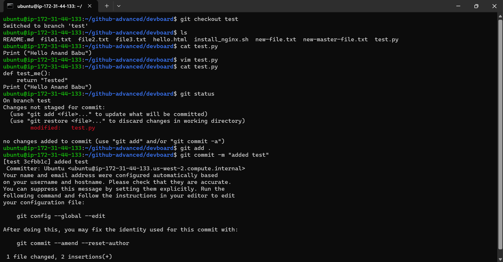
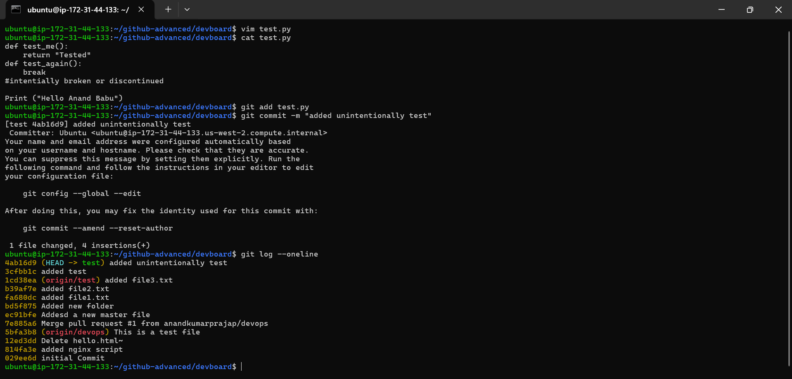
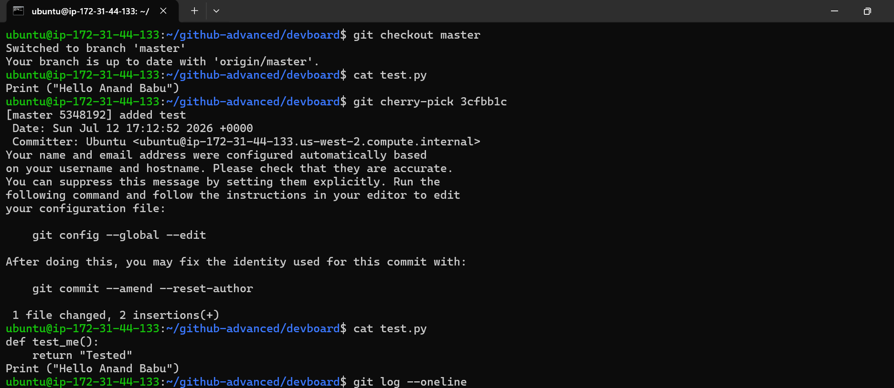
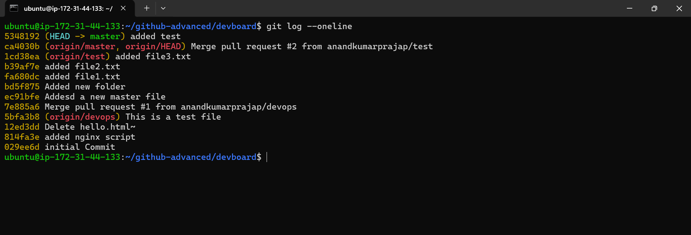

# Git Cherry-Pick

## 📌 Definition

`git cherry-pick` is used to **copy the changes introduced by a specific commit from one branch and apply them to another branch**.

It does **not merge the complete branch**. It only takes the selected commit(s).

### Simple Meaning

> **Cherry-pick = Take a specific commit from another branch and apply it to your current branch.**

---

# 📌 Why Use Cherry-Pick?

Cherry-pick is useful when:

* You need only **one specific commit** from another branch.
* You do not want to merge the entire branch.
* A bug fix exists on another branch and you need the same fix on `master`.
* You want to move a particular feature/change between branches.
* You want to practice or demonstrate individual commit management.

---

# 📌 Basic Syntax

```bash
git cherry-pick <commit-id>
```

Example:

```bash
git cherry-pick 3cfbb1c
```

This takes commit `3cfbb1c` and applies its changes to the current branch.

---

# 📌 Important Point

Cherry-pick works on the **current branch**.

First switch to the branch where you want the commit:

```bash
git switch master
```

Then cherry-pick the required commit:

```bash
git cherry-pick 3cfbb1c
```

---

# 🧪 Practical Example

Suppose we have two branches:

```text
master
   |
   A---B---C
        \
test     D---E
```

Commit `D` contains a change that we want in `master`.

Switch to `master`:

```bash
git switch master
```

Cherry-pick commit `D`:

```bash
git cherry-pick <commit-D-ID>
```

After cherry-pick:

```text
             D'
            /
master A---B---C---D'
        \
test     D---E
```

`D'` is a **new commit** on `master`.

The changes from `D` are copied, but the original commit itself is not moved.

---

# 🔥 Your Practical Example

You had this situation:

### `test` branch

```text
1cd38ea  added file3.txt
3cfbb1c  added test
4ab16d9  added unintentionally test
```

The commit:

```text
3cfbb1c
```

contained the intended change to `test.py`.

You wanted that particular change in `master`, but you did **not** want the later commit:

```text
4ab16d9
```

So you switched to `master`:

```bash
git switch master
```

Then ran:

```bash
git cherry-pick 3cfbb1c
```

Git created a new commit on `master`:

```text
5348192 added test
```

---

# 📊 Your Actual Workflow

Before cherry-pick:

```text
TEST BRANCH

1cd38ea
   |
3cfbb1c  ← added test
   |
4ab16d9  ← added unintentionally test
   |
  HEAD
```

`master`:

```text
master
   |
ca4030b
   |
HEAD
```

You selected only:

```text
3cfbb1c
```

Then:

```bash
git switch master
git cherry-pick 3cfbb1c
```

Result:

```text
TEST

1cd38ea
   |
3cfbb1c
   |
4ab16d9
   |
  HEAD


MASTER

ca4030b
   |
5348192  ← cherry-picked changes from 3cfbb1c
   |
  HEAD
```

---

# 🧠 Important: Cherry-Pick Creates a New Commit

The original commit was:

```text
3cfbb1c
```

After cherry-picking, `master` received:

```text
5348192
```

So:

```text
test:
3cfbb1c

master:
5348192
```

The commit IDs are different because Git created a **new commit**.

The changes can be the same, but the commit is new.

---

# 🔍 Check Commit History

View commits:

```bash
git log --oneline
```

Better visualization:

```bash
git log --oneline --graph --decorate --all
```

View the original commit:

```bash
git show 3cfbb1c
```

View the cherry-picked commit:

```bash
git show 5348192
```

---

# 📌 Cherry-Pick Multiple Commits

You can cherry-pick multiple individual commits:

```bash
git cherry-pick <commit1> <commit2> <commit3>
```

Example:

```bash
git cherry-pick 3cfbb1c 4ab16d9
```

---

# 📌 Cherry-Pick a Range

You can cherry-pick a range of commits.

Example:

```bash
git cherry-pick A..D
```

This generally means:

```text
B
C
D
```

are selected, while `A` is excluded.

For a clearer inclusive range:

```bash
git cherry-pick A^..D
```

---

# ⚠️ Cherry-Pick Conflict

Sometimes the selected commit conflicts with the current branch.

Git may show:

```text
CONFLICT (content): Merge conflict in test.py
```

Check the conflict:

```bash
git status
```

Fix the file manually.

Then:

```bash
git add test.py
```

Continue cherry-pick:

```bash
git cherry-pick --continue
```

---

# ❌ Abort Cherry-Pick

If you don't want to continue:

```bash
git cherry-pick --abort
```

This attempts to return the branch to the state before the cherry-pick started.

---

# ⏭️ Skip a Commit

When Git is processing a sequence of cherry-picked commits and you want to skip the current one:

```bash
git cherry-pick --skip
```

---

# 📌 Abort vs Continue vs Skip

| Command                      | Purpose                           |
| ---------------------------- | --------------------------------- |
| `git cherry-pick --continue` | Continue after resolving conflict |
| `git cherry-pick --abort`    | Cancel the cherry-pick operation  |
| `git cherry-pick --skip`     | Skip the current commit           |

---

# 📌 Find Commit ID

Use:

```bash
git log --oneline
```

Example:

```text
4ab16d9 added unintentionally test
3cfbb1c added test
1cd38ea added file3.txt
```

Select the required commit:

```bash
git cherry-pick 3cfbb1c
```

---

# 📌 Verify the Result

After cherry-pick:

```bash
git status
```

Then:

```bash
git log --oneline --graph --decorate --all
```

And inspect the file:

```bash
cat test.py
```

---

# 🔄 Cherry-Pick vs Merge

## Cherry-Pick

```bash
git cherry-pick <commit-id>
```

Takes **specific commit(s)**.

```text
test:    A---B---C
              \
master:  X-----B'
```

Only the changes from `B` are applied to `master`.

---

## Merge

```bash
git merge test
```

Combines the **branch history**.

```text
test:    A---B---C
              \   \
master:  X-----M---?
```

Merge is generally used when you want to integrate the branch as a whole.

---

# 🆚 Cherry-Pick vs Merge vs Rebase

| Command           | Main Purpose                                       |
| ----------------- | -------------------------------------------------- |
| `git cherry-pick` | Apply specific commit(s)                           |
| `git merge`       | Combine branches                                   |
| `git rebase`      | Reapply commits on a new base                      |
| `git revert`      | Create a new commit that undoes an existing commit |

### Easy Memory Trick

```text
Cherry-Pick → Pick specific commit 🍒
Merge       → Combine branches
Rebase      → Move/replay commits
Revert      → Undo a commit safely
```

---

# 🌳 Visual Diagram

```text
                    TEST BRANCH

A---B---C---D
        |
        C = "added test"
        |
        D = "added unintentionally test"


MASTER

A---B


You run:

git switch master
git cherry-pick C


Result:

                    TEST
A---B---C---D
        |
        |
        | cherry-pick
        ↓

MASTER
A---B---C'


C  = original commit
C' = new cherry-picked commit
```

---

# 🚀 Complete Command Workflow

```bash
# 1. Check branches
git branch

# 2. View commits
git log --oneline --all

# 3. Switch to destination branch
git switch master

# 4. Cherry-pick selected commit
git cherry-pick 3cfbb1c

# 5. Check status
git status

# 6. Check history
git log --oneline --graph --decorate --all

# 7. Push to remote
git push origin master
```

---

# 💡 Real-World DevOps Example

Suppose a developer has a production bug fix:

```text
developer branch

A---B---C
        |
        C = Fix production bug
```

You don't want to merge all developer work into `master`.

Instead:

```bash
git switch master
git cherry-pick C
git push origin master
```

Now only the bug-fix changes are applied to `master`.

---

# ⚠️ Things to Remember

1. Cherry-pick works on the **current branch**.
2. You need the **commit ID**.
3. It copies the changes from a commit.
4. Git creates a **new commit** on the destination branch.
5. The original commit remains on the source branch.
6. Cherry-pick can produce conflicts.
7. Use `--continue` after resolving conflicts.
8. Use `--abort` to cancel an ongoing cherry-pick.
9. Always inspect the history after cherry-picking.

---

# 🎯 One-Line Definition

> **`git cherry-pick` applies the changes from a specific existing commit onto your current branch by creating a new commit.**

# ⭐ Most Important Command

```bash
git switch master
git cherry-pick <commit-id>
```

Example:

```bash
git switch master
git cherry-pick 3cfbb1c
```
