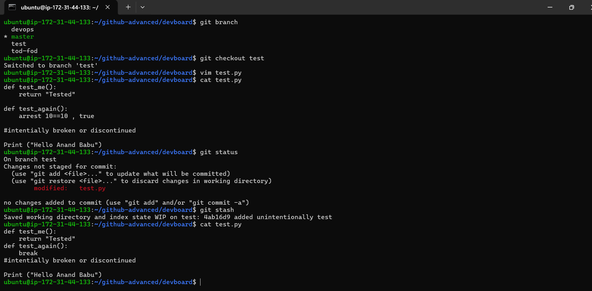
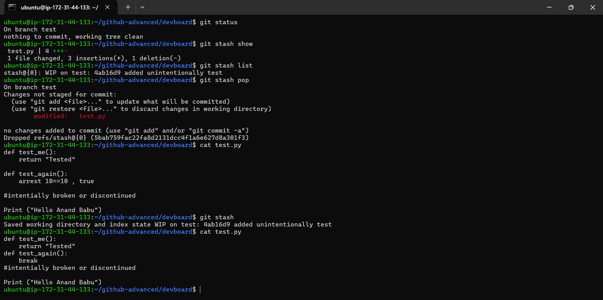
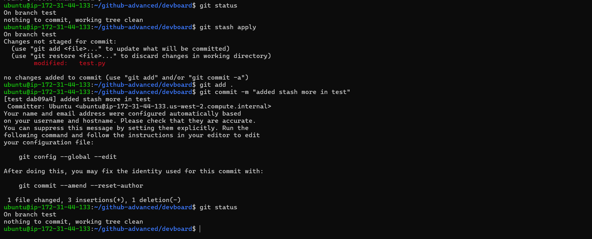

# Git Stash

## 📌 Definition

`git stash` temporarily saves your **uncommitted changes** (modified and staged files) and returns the working directory to a clean state.

It is useful when you are working on one task but suddenly need to:

* Switch to another branch
* Pull or merge changes
* Fix an urgent issue
* Test another branch
* Save unfinished work without creating a commit

---

# Why Do We Use Git Stash?

Suppose you are working on `test.py`:

```text
test.py
   ↓
You make some changes
   ↓
Changes are NOT ready for commit
   ↓
Urgent work comes
   ↓
You need a clean working tree
   ↓
git stash
   ↓
Changes are safely stored temporarily
   ↓
Working tree becomes clean
```

Instead of creating an unnecessary commit, you can use `git stash`.

---

# Git Stash Workflow

```text
                Working on test branch
                         │
                         ▼
                  Modify test.py
                         │
                         ▼
                    git status
                         │
                         ▼
                  Changes detected
                         │
                         ▼
                     git stash
                         │
                         ▼
              ┌─────────────────────┐
              │ Changes saved in    │
              │ stash               │
              └─────────────────────┘
                         │
                         ▼
               Working tree clean
                         │
              ┌──────────┴──────────┐
              │                     │
              ▼                     ▼
       git stash apply        git stash pop
              │                     │
              │                     └── Apply + remove stash
              ▼
       Changes restored
              │
              ▼
          git status
              │
              ▼
           git add
              │
              ▼
         git commit
```

---

# 1. Check Current Changes

```bash
git status
```

Shows modified, staged, and untracked files.

Example:

```text
On branch test

Changes not staged for commit:
    modified: test.py
```

---

# 2. Create a Stash

```bash
git stash
```

Example:

```bash
git stash
```

Output:

```text
Saved working directory and index state WIP on test
```

Your changes are temporarily stored.

The working directory becomes clean.

Check:

```bash
git status
```

Output:

```text
nothing to commit, working tree clean
```

---

# 3. List All Stashes

```bash
git stash list
```

Example:

```text
stash@{0}: WIP on test: 4ab16d9 added unintentionally test
stash@{1}: WIP on devops: 5bfa3b8 This is a test file
```

### Meaning

```text
stash@{0}
   │
   └── Latest stash

stash@{1}
   │
   └── Previous stash
```

The latest stash is normally:

```bash
stash@{0}
```

---

# 4. Show Stash Information

```bash
git stash show
```

Shows a summary of the latest stash.

For example:

```text
test.py | 4 +++-
1 file changed, 3 insertions(+), 1 deletion(-)
```

To see the complete diff:

```bash
git stash show -p
```

or:

```bash
git stash show --patch
```

---

# 5. Apply Stash

```bash
git stash apply
```

This restores the latest stash **but keeps the stash entry**.

Example:

```text
Before:

stash@{0}: WIP on test

        ↓
git stash apply

        ↓

Changes restored
stash@{0} still exists
```

Check:

```bash
git stash list
```

The stash will still be present.

---

# 6. Apply a Specific Stash

```bash
git stash apply stash@{1}
```

This applies a particular stash.

Example:

```bash
git stash list
```

```text
stash@{0}: WIP on test
stash@{1}: WIP on devops
```

Apply the older stash:

```bash
git stash apply stash@{1}
```

---

# 7. Pop Stash

```bash
git stash pop
```

`git stash pop` does two things:

```text
Apply stash
    +
Remove stash
```

Visualization:

```text
stash@{0}
   │
   ▼
git stash pop
   │
   ├── Restore changes
   │
   └── Delete stash entry
```

Example:

```bash
git stash pop
```

If successful, Git may show:

```text
Changes not staged for commit:
    modified: test.py

Dropped refs/stash@{0}
```

---

# 8. Difference Between `apply` and `pop`

| Command           | Restore Changes | Remove Stash |
| ----------------- | --------------- | ------------ |
| `git stash apply` | ✅ Yes           | ❌ No         |
| `git stash pop`   | ✅ Yes           | ✅ Yes        |

### Easy Rule

```text
apply = Apply only

pop = Apply + Delete
```

---

# 9. Create a Named Stash

Instead of an unclear WIP message:

```bash
git stash push -m "testing changes"
```

Example:

```bash
git stash push -m "test.py changes"
```

List it:

```bash
git stash list
```

Output:

```text
stash@{0}: On test: test.py changes
```

This makes it easier to understand why the stash was created.

---

# 10. Delete a Specific Stash

```bash
git stash drop stash@{0}
```

Example:

```bash
git stash drop stash@{0}
```

This deletes only that stash.

---

# 11. Delete All Stashes

```bash
git stash clear
```

⚠️ This removes **all stash entries**.

Use carefully.

---

# 12. Stash Untracked Files

Normally:

```bash
git stash
```

does not stash untracked files.

To include untracked files:

```bash
git stash -u
```

or:

```bash
git stash --include-untracked
```

Example:

```bash
git stash push -u -m "save application changes"
```

---

# 13. Stash Everything Including Ignored Files

```bash
git stash -a
```

or:

```bash
git stash --all
```

This includes:

* Modified files
* Staged files
* Untracked files
* Ignored files

Use this carefully because ignored files may contain generated or sensitive data.

---

# 14. Stash Only Staged Changes

```bash
git stash push --staged
```

This stashes changes that are currently staged.

---

# 15. Complete Practical Example

Suppose you are on the `test` branch:

```bash
git checkout test
```

Modify:

```text
test.py
```

Check:

```bash
git status
```

You see:

```text
modified: test.py
```

Now save the unfinished work:

```bash
git stash
```

Check:

```bash
git status
```

Result:

```text
nothing to commit, working tree clean
```

Check saved stash:

```bash
git stash list
```

Then restore it:

```bash
git stash apply
```

Check:

```bash
git status
```

Now:

```text
modified: test.py
```

After checking the changes:

```bash
git add test.py
```

Commit:

```bash
git commit -m "added stash changes to test"
```

Check:

```bash
git status
```

Result:

```text
nothing to commit, working tree clean
```

---

# 16. `git stash apply` vs `git stash pop`

### `apply`

```bash
git stash apply
```

```text
Stash
  │
  ├── Restore changes ──► Working directory
  │
  └── Keep stash
```

### `pop`

```bash
git stash pop
```

```text
Stash
  │
  ├── Restore changes ──► Working directory
  │
  └── Delete stash
```

---

# 17. Important Stash Commands

```bash
# Check changes
git status

# Create stash
git stash

# Create named stash
git stash push -m "message"

# List stashes
git stash list

# Show latest stash
git stash show

# Show complete stash diff
git stash show -p

# Apply latest stash
git stash apply

# Apply specific stash
git stash apply stash@{1}

# Apply and remove latest stash
git stash pop

# Delete specific stash
git stash drop stash@{0}

# Delete all stashes
git stash clear

# Include untracked files
git stash -u

# Include ignored files too
git stash -a
```

---

# 18. Important Difference: Stash vs Commit

| Feature                       | `git stash` | `git commit`         |
| ----------------------------- | ----------- | -------------------- |
| Permanently records a change  | ❌           | ✅                    |
| Intended for unfinished work  | ✅           | Usually no           |
| Creates commit                | ❌           | ✅                    |
| Cleans working tree           | ✅           | Usually after commit |
| Can restore later             | ✅           | ✅                    |
| Shared with remote using push | ❌           | ✅                    |
| Good for temporary work       | ✅           | ❌                    |

### Simple Understanding

```text
git stash
    ↓
Temporary storage

git commit
    ↓
Permanent project history
```

---

# 19. Common Mistakes

### Mistake 1: Thinking `stash` creates a normal commit

It does not create a normal branch-history commit.

```bash
git stash
```

stores your work in Git's stash area.

---

### Mistake 2: Using `pop` when you want to keep the stash

If you want the stash entry to remain:

```bash
git stash apply
```

If you want to restore and remove it:

```bash
git stash pop
```

---

### Mistake 3: Forgetting untracked files

If you have:

```text
new-file.txt
```

and run:

```bash
git stash
```

the untracked file normally isn't included.

Use:

```bash
git stash -u
```

---

# 20. Interview Definition

> **Git stash is used to temporarily save uncommitted changes so that we can get a clean working directory and switch to another task or branch without committing unfinished work.**

### Interview Example

> Suppose I am working on a feature and have some unfinished changes, but I need to switch to another branch for an urgent fix. I use `git stash` to temporarily save my changes. After completing the urgent work, I can use `git stash apply` or `git stash pop` to restore my changes.

---

# 21. Quick Memory Trick

```text
stash
  ↓
Save temporarily

stash list
  ↓
See saved stashes

stash show
  ↓
See stash changes

stash apply
  ↓
Restore + KEEP stash

stash pop
  ↓
Restore + REMOVE stash

stash drop
  ↓
Delete one stash

stash clear
  ↓
Delete ALL stashes
```

---

# 22. Your Practice Flow

Your practice followed this pattern:

```text
test branch
    │
    ▼
Modify test.py
    │
    ▼
git status
    │
    ▼
Modified: test.py
    │
    ▼
git stash
    │
    ▼
Working tree clean
    │
    ▼
git stash list
    │
    ▼
stash@{0}
    │
    ├──────────────┐
    ▼              ▼
stash apply     stash pop
    │              │
    ▼              ▼
Restore         Restore
changes         changes
    │              │
    ▼              ▼
Stash remains   Stash removed
    │
    ▼
git add test.py
    │
    ▼
git commit -m "added stash changes to test"
```

## ⭐ One-Line Summary

```text
git stash = Temporarily save uncommitted work so you can work with a clean working directory.
```
