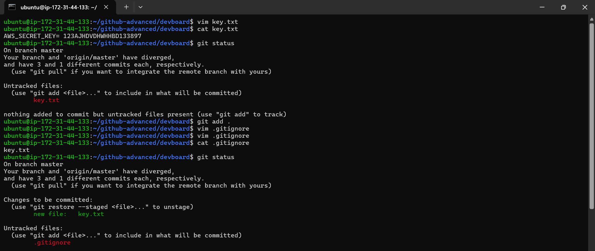
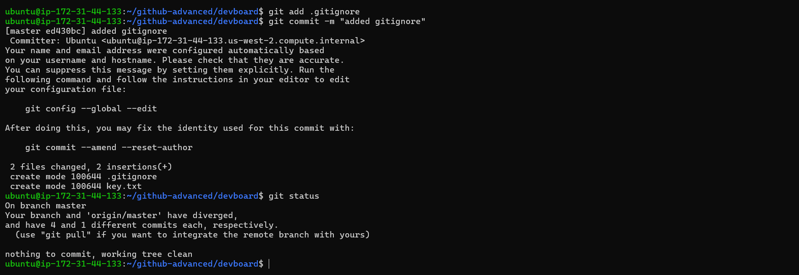
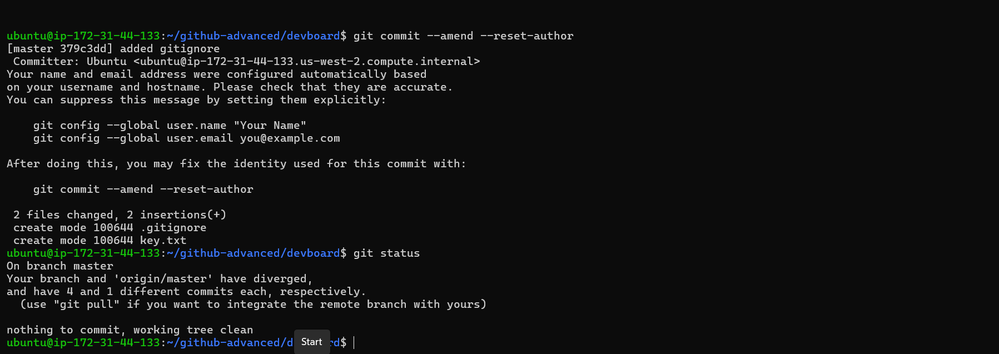
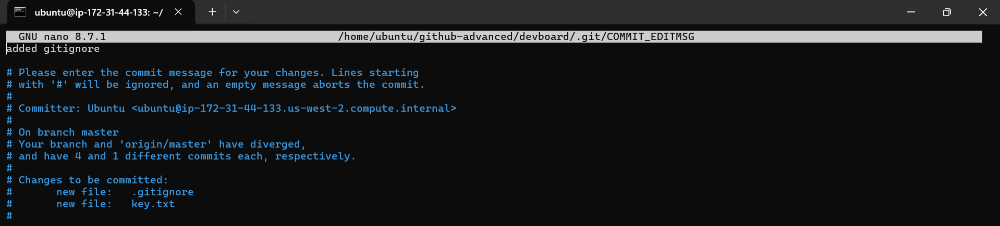
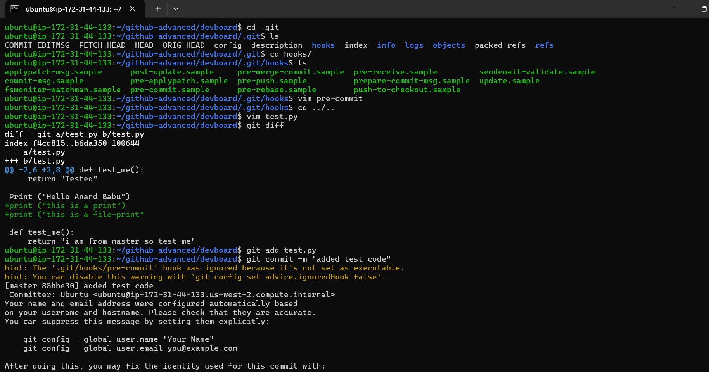
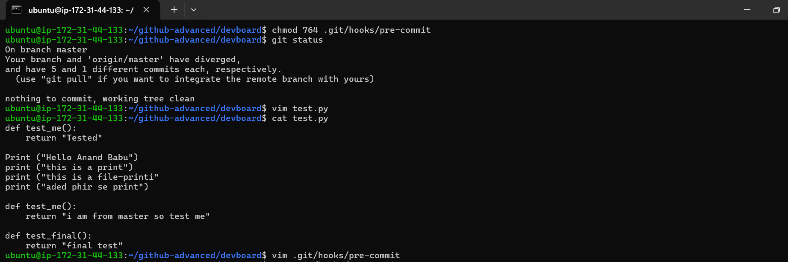
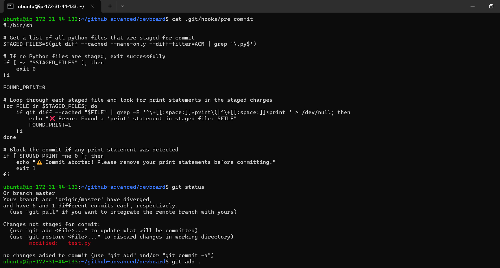
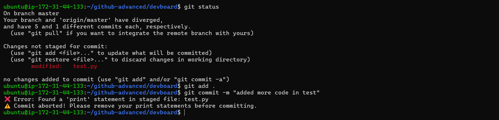
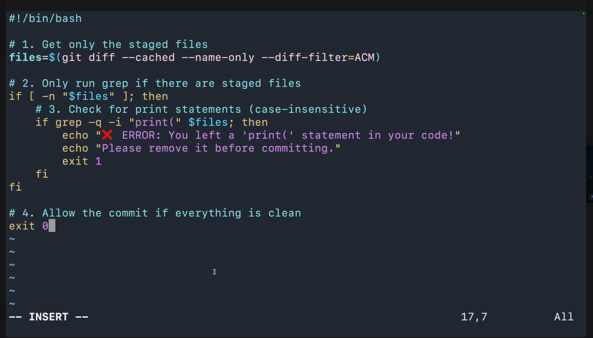

# Git Ignore, Git Hooks & Amend

## 1. Git Ignore

`.gitignore` tells Git which files or folders should **not be tracked**.

### Create `.gitignore`

```bash
vim .gitignore
```

Example:

```text
key.txt
.env
*.log
__pycache__/
```

Check:

```bash
cat .gitignore
```

### Important

If a file is **already tracked**, adding it to `.gitignore` will not remove it from Git tracking.

Remove it from tracking:

```bash
git rm --cached key.txt
```

Then:

```bash
git add .gitignore
git commit -m "added gitignore"
```

---

# 2. Git Hooks

Git Hooks are scripts that automatically run at specific Git operations.

Common hooks:

```text
pre-commit
pre-push
commit-msg
post-commit
```

Hooks are stored inside:

```bash
.git/hooks/
```

Check hooks:

```bash
ls .git/hooks/
```

---

## 3. Pre-Commit Hook

`pre-commit` runs **before a commit is created**.

Create/edit it:

```bash
vim .git/hooks/pre-commit
```

Example:

```bash
#!/bin/bash

files=$(git diff --cached --name-only --diff-filter=ACM | grep '\.py$')

if [ -n "$files" ]; then
    if grep -q "print(" $files; then
        echo "ERROR: You left a print() statement in your code!"
        echo "Please remove it before committing."
        exit 1
    fi
fi

exit 0
```

Make the hook executable:

```bash
chmod +x .git/hooks/pre-commit
```

Check permission:

```bash
ls -l .git/hooks/pre-commit
```

You should see executable permission, for example:

```text
-rwxr-xr-x
```

---

## 4. Test the Pre-Commit Hook

Modify a Python file:

```bash
vim test.py
```

Add:

```python
print("Hello Anand")
```

Stage it:

```bash
git add test.py
```

Try to commit:

```bash
git commit -m "added test code"
```

The hook should block the commit:

```text
ERROR: You left a print() statement in your code!
Please remove it before committing.
```

Remove the `print()` statement:

```bash
vim test.py
```

Then:

```bash
git add test.py
git commit -m "added test code"
```

Now the commit should succeed.

---

# 5. Amend Last Commit

`git commit --amend` is used to modify the **latest commit**.

### Change the commit message

```bash
git commit --amend -m "new commit message"
```

### Add another change to the latest commit

```bash
git add test.py
git commit --amend --no-edit
```

`--no-edit` keeps the existing commit message.

---

# 6. Change Commit Author

Set Git identity:

```bash
git config --global user.name "Your Name"
git config --global user.email "you@example.com"
```

Check:

```bash
git config --global user.name
git config --global user.email
```

Fix the author of the latest commit:

```bash
git commit --amend --reset-author
```

Or change author explicitly:

```bash
git commit --amend --author="Your Name <you@example.com>"
```

---

# 7. Three Important Commands

### Git Ignore

```bash
git add .gitignore
```

### Git Hook

```bash
chmod +x .git/hooks/pre-commit
```

### Amend

```bash
git commit --amend --no-edit
```

---

# 8. Quick Workflow

```bash
vim .gitignore
git add .gitignore
git commit -m "added gitignore"

vim .git/hooks/pre-commit
chmod +x .git/hooks/pre-commit

vim test.py
git add test.py
git commit -m "added test code"

git commit --amend --no-edit
```

---

# 9. Important Difference

| Feature              | Purpose                                   |
| -------------------- | ----------------------------------------- |
| `.gitignore`         | Prevent unwanted files from being tracked |
| `pre-commit`         | Run checks before creating a commit       |
| `git commit --amend` | Modify the latest commit                  |
| `chmod +x`           | Make the hook executable                  |
| `git rm --cached`    | Stop tracking an already tracked file     |

---

## Important Security Note

Never commit AWS credentials, passwords, API keys, or secret keys.

For example, this should **never be committed**:

```text
AWS_SECRET_KEY=your-secret-key
```

Use `.gitignore` for local secret files such as:

```text
key.txt
.env
```

.....................................................................................................................................................................................


# Windows Hook Compatibility

Git hooks work on both Linux and Windows, but there are a few differences.

## 1. Hook Location

The hook is stored in:

```text
.git/hooks/pre-commit
```

This location is the same on Linux and Windows.

## 2. Linux / macOS

A shell hook can use:

```bash
#!/bin/bash
```

Make it executable:

```bash
chmod +x .git/hooks/pre-commit
```

## 3. Windows

When using **Git Bash**, shell-based hooks such as:

```bash
#!/bin/bash
```

generally work the same way.

However, `chmod +x` is not normally needed in the same way as on Linux because Git for Windows handles hooks differently.

A simple portable approach is to use a shell script with:

```bash
#!/bin/sh
```

For example:

```bash
#!/bin/sh

files=$(git diff --cached --name-only --diff-filter=ACM | grep '\.py$')

if [ -n "$files" ]; then
    if grep -q "print(" $files; then
        echo "ERROR: You left a print() statement in your code!"
        exit 1
    fi
fi

exit 0
```

## 4. Windows Line Endings

Windows commonly uses **CRLF** line endings, while Linux commonly uses **LF**.

Git can handle this automatically with:

```bash
git config --global core.autocrlf true
```

For Linux/macOS:

```bash
git config --global core.autocrlf input
```

Check the current setting:

```bash
git config --global core.autocrlf
```

## 5. PowerShell Hook

If you prefer PowerShell on Windows, you can use a PowerShell hook approach, but a `/bin/sh` hook is usually easier to keep compatible across Linux, macOS, and Git Bash.

### Recommended

For a team working across operating systems:

```text
Use /bin/sh
Avoid OS-specific commands
Keep the hook simple
Test the hook on each operating system
```

## Quick Reference

| Environment          | Recommended approach     |
| -------------------- | ------------------------ |
| Linux                | `/bin/sh` or `/bin/bash` |
| macOS                | `/bin/sh` or `/bin/bash` |
| Windows + Git Bash   | `/bin/sh` or `/bin/bash` |
| Windows + PowerShell | PowerShell script        |
| Cross-platform team  | Prefer `/bin/sh`         |

> **Tip:** Hooks inside `.git/hooks` are local to each clone. They are not automatically shared through Git when you push the repository. For team-wide hooks, consider a version-controlled hooks directory or a tool such as pre-commit.


...............................................................................................................................................................................................


# Native PowerShell Pre-Commit Hook

On Windows, you can create a native **PowerShell pre-commit hook**.

## 1. Create the Hook

From the repository root:

```powershell
notepad .git/hooks/pre-commit
```

Add:

```powershell
#!/usr/bin/env pwsh

$files = git diff --cached --name-only --diff-filter=ACM |
         Where-Object { $_ -match '\.py$' }

foreach ($file in $files) {
    $content = Get-Content $file -Raw

    if ($content -match 'print\s*\(') {
        Write-Host "ERROR: You left a print() statement in $file!"
        Write-Host "Please remove it before committing."
        exit 1
    }
}

exit 0
```

## 2. How It Works

The hook:

1. Gets the Python files staged for commit.
2. Reads each staged Python file.
3. Searches for `print(...)`.
4. If found, the commit is blocked.
5. If no `print()` is found, the commit continues.

## 3. Test the Hook

Add a print statement:

```powershell
Add-Content test.py 'print("Hello Anand")'
```

Stage it:

```powershell
git add test.py
```

Commit:

```powershell
git commit -m "test powershell hook"
```

Expected:

```text
ERROR: You left a print() statement in test.py!
Please remove it before committing.
```

The commit is rejected.

Remove the `print()` statement, then:

```powershell
git add test.py
git commit -m "test powershell hook"
```

The commit should succeed.

## 4. Important Windows Note

The hook file must be named exactly:

```text
.git/hooks/pre-commit
```

Git can execute a PowerShell script through the shebang:

```powershell
#!/usr/bin/env pwsh
```

This requires **PowerShell 7 (`pwsh`)** to be available in `PATH`.

Check:

```powershell
pwsh --version
```

If you specifically use Windows PowerShell 5.1, `pwsh` may not exist. For maximum cross-platform compatibility, prefer a `/bin/sh` hook with Git Bash.

## Quick Comparison

| Hook                   | Windows  | Linux | macOS |
| ---------------------- | -------- | ----- | ----- |
| `/bin/sh`              | Git Bash | ✅     | ✅     |
| `/bin/bash`            | Git Bash | ✅     | ✅     |
| `PowerShell` (`pwsh`)  | ✅        | ✅     | ✅     |
| Windows PowerShell 5.1 | ✅        | ❌     | ❌     |

> **Recommended:** Use `/bin/sh` when the repository is shared across different operating systems. Use the native PowerShell hook when your development environment is primarily Windows.


If a real AWS secret was ever committed or exposed, **rotate/revoke that credential immediately** rather than relying only on `.gitignore`.

