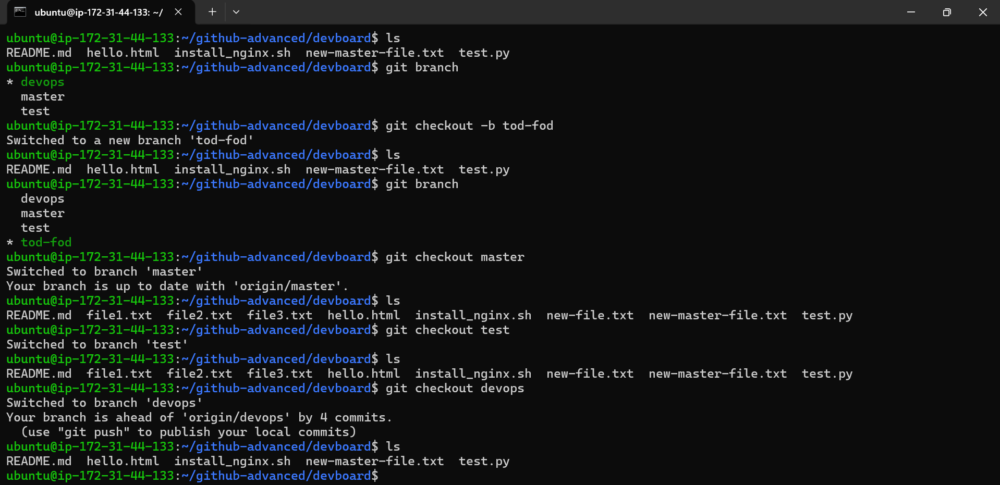
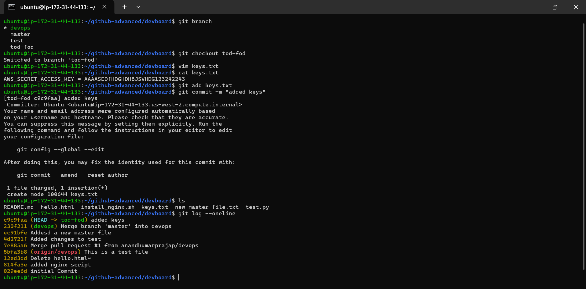
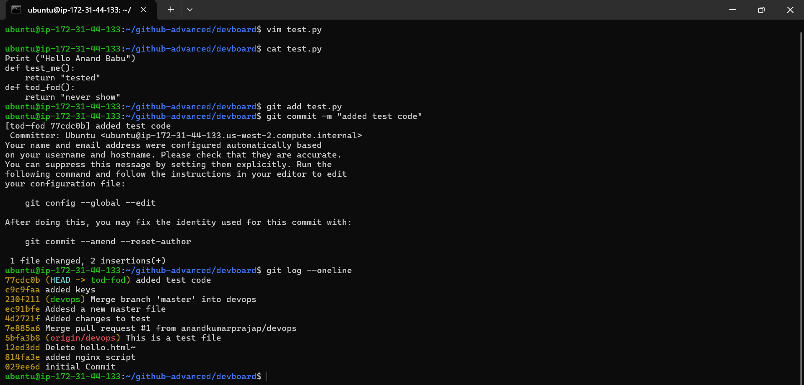
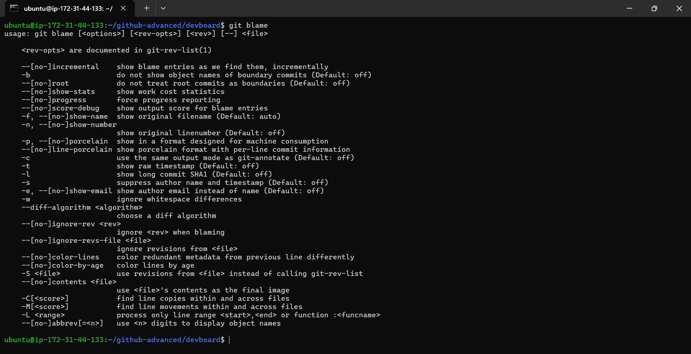
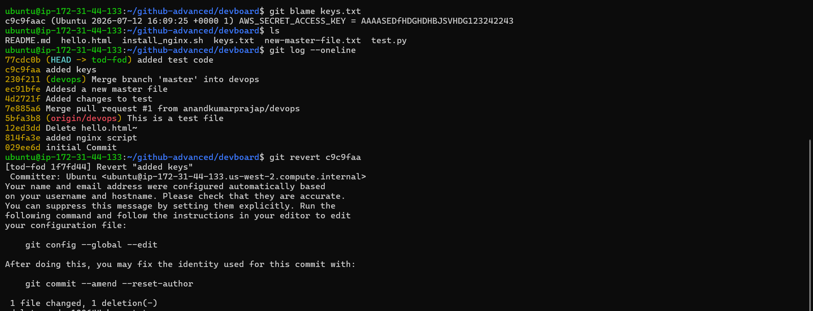
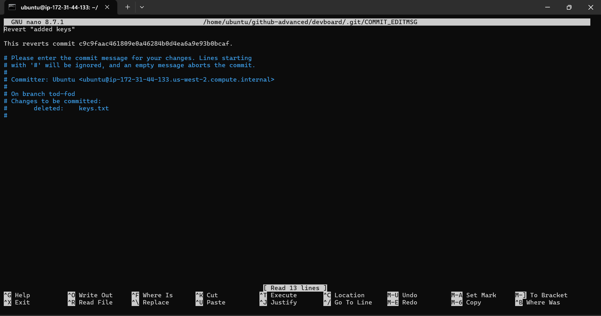
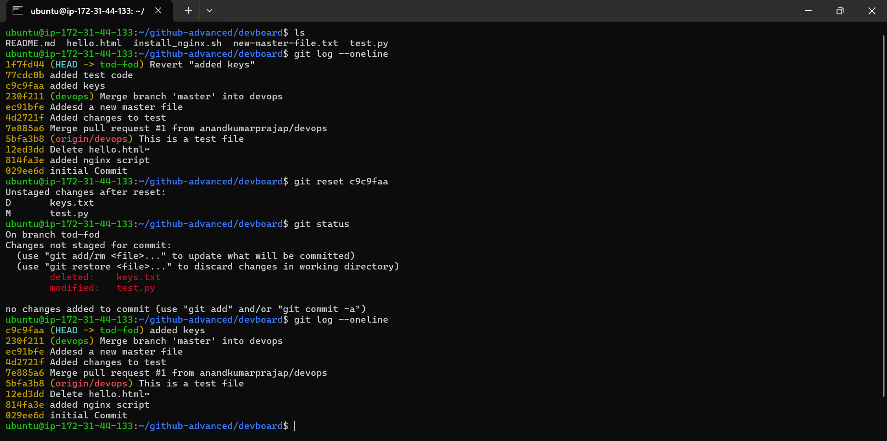
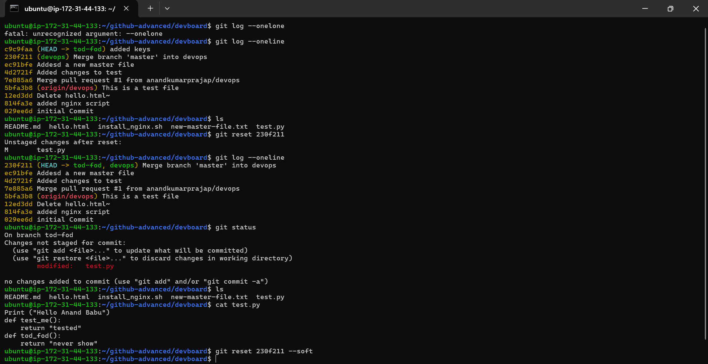
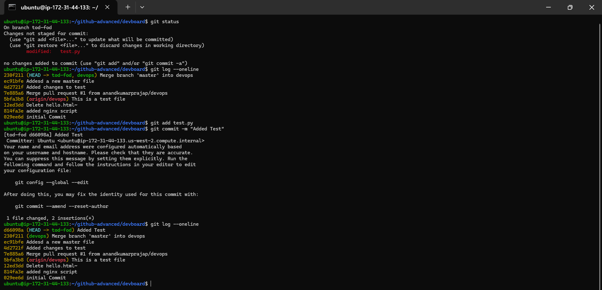
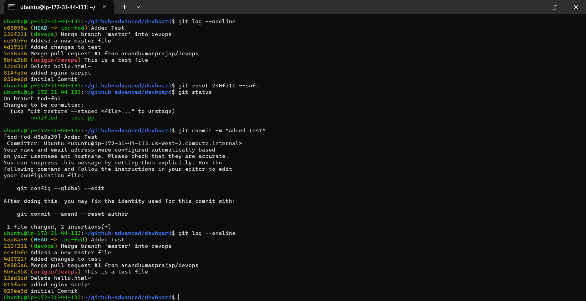
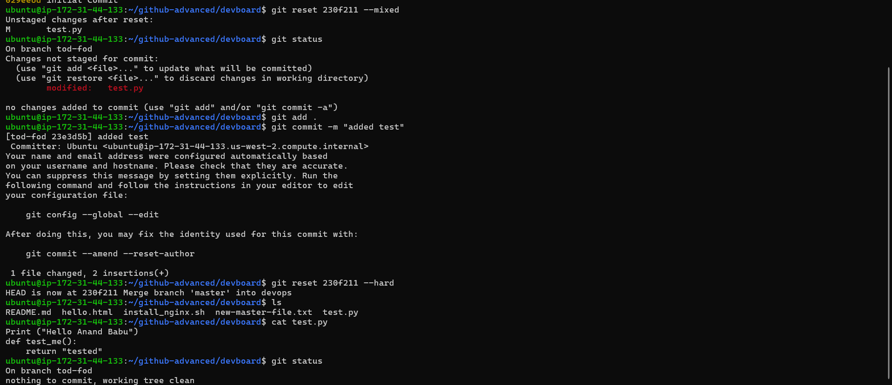

# Git Undoing, Revert & Blame — Simple Notes

## 1. `git blame`

### Definition
`git blame` shows **who last changed each line of a file**, along with the commit ID, author, date, and line number.

### Use
- Find which commit changed a particular line.
- Find the author of a line.
- Debug or investigate when a change was introduced.

### Command
```bash
git blame keys.txt
```

### Example
```text
c9c9faa (Ubuntu 2026-07-12 ...) 1 AWS_SECRET_ACCESS_KEY = ...
```

Here `c9c9faa` is the commit that introduced/last changed that line.

---

## 2. `git revert`

### Definition
`git revert` **undoes the changes of a specific commit by creating a new commit**.

It does NOT delete the original commit from history.

### Use
Use `revert` when the commit is already shared/pushed and you want a safe undo.

### Command
```bash
git revert c9c9faa
```

This creates a new commit similar to:
```text
Revert "added keys"
```

### Important
```text
Original commit     → remains in history
Revert commit       → reverses its changes
```

---

## 3. `git reset`

### Definition
`git reset` moves the current branch `HEAD` to another commit.

It can also change what happens to the staging area and working directory depending on the option.

### General command
```bash
git reset <commit-id>
```

Example:
```bash
git reset c9c9faa
```

---

# 4. `git reset 230f211` — Mixed Reset

### Command
```bash
git reset 230f211
```

This is the default **mixed** reset.

### What it does
- Moves `HEAD` to `230f211`.
- Resets the staging area.
- Keeps working-directory changes.
- Changes become **unstaged**.

### Example
```text
Before:
A → B → C → D (HEAD)

git reset B

After:
A → B (HEAD)
    C and D changes remain in working directory
```

### Check
```bash
git status
```

---

# 5. `git reset 230f211 --soft`

### Command
```bash
git reset 230f211 --soft
```

### What it does
- Moves `HEAD` to `230f211`.
- Keeps changes **staged**.
- Working files are kept unchanged.

### Use
Useful when you want to remove/recombine commits but keep their changes ready for a new commit.

### Check
```bash
git status
```

You will normally see:
```text
Changes to be committed:
    modified: test.py
```

---

# 6. `git reset 230f211 --mixed`

### Command
```bash
git reset 230f211 --mixed
```

### What it does
- Moves `HEAD` to `230f211`.
- Unstages changes.
- Keeps changes in the working directory.

This is the default behavior of:
```bash
git reset 230f211
```

### Check
```bash
git status
```

You will normally see:
```text
Changes not staged for commit:
    modified: test.py
```

---

# 7. `git reset 230f211 --hard`

### Command
```bash
git reset 230f211 --hard
```

### What it does
- Moves `HEAD` to `230f211`.
- Resets staging area.
- Resets working directory to that commit.
- **Discards local changes after that commit.**

### Important ⚠️
`--hard` can permanently remove uncommitted work.

Use it carefully.

### Check
```bash
git status
```

Expected:
```text
nothing to commit, working tree clean
```

---

# 8. Quick Difference

| Command | HEAD | Staging Area | Working Directory |
|---|---|---|---|
| `git reset <commit>` | Moves | Reset | Keeps changes |
| `git reset <commit> --soft` | Moves | Keeps changes staged | Keeps changes |
| `git reset <commit> --mixed` | Moves | Unstages changes | Keeps changes |
| `git reset <commit> --hard` | Moves | Reset | Discards changes |
| `git revert <commit>` | New commit | Updated by revert | Updated by revert |

---

# 9. Easy Memory Trick

```text
SOFT
HEAD moves
Changes stay STAGED

MIXED
HEAD moves
Changes become UNSTAGED

HARD
HEAD moves
Changes are DISCARDED

REVERT
HEAD/history stays
NEW commit UNDOES old commit

BLAME
Shows WHO changed WHICH LINE
```

---

# 10. Commands From Practice

### Check history
```bash
git log --oneline
```

### Find who changed lines
```bash
git blame keys.txt
```

### Safely undo a commit with a new commit
```bash
git revert c9c9faa
```

### Mixed reset (default)
```bash
git reset 230f211
```

### Soft reset
```bash
git reset 230f211 --soft
```

### Mixed reset explicitly
```bash
git reset 230f211 --mixed
```

### Hard reset
```bash
git reset 230f211 --hard
```

### Check result
```bash
git status
git log --oneline
```

## Key Rule

**Revert = undo with a new commit.**

**Reset = move the branch pointer (`HEAD`) backward/forward.**

**Blame = identify who last changed each line.**
